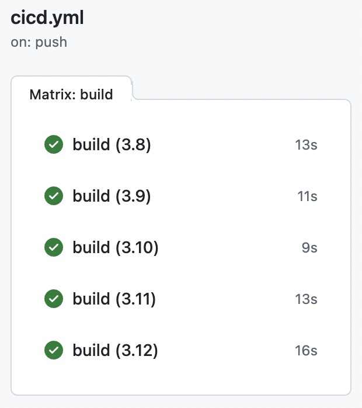
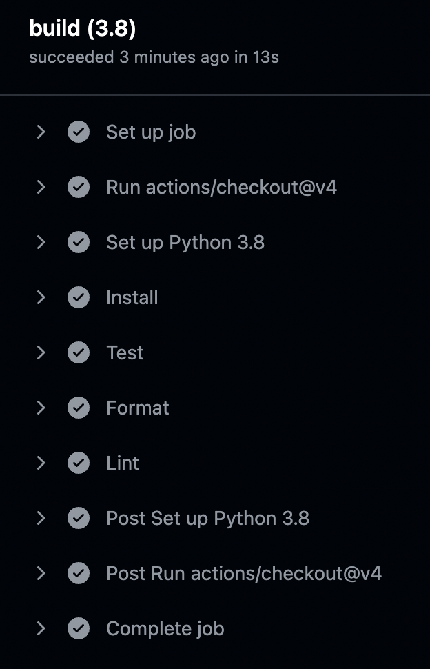

Check CI/CD Status: 

# Mini-project #4
#### Repo Title: kim_seijung_project4_github_matrix
#### Author: Seijung Kim (sk591)

## Overview
This project aims to create a GitHub Actions Matrix Build that tests across five different versions of Python (Python 3.8, 3.9, 3.10, 3.11 and 3.12). Through the Matrix Build, we can ensure the project's reliability and compatibility with different Python environments. GitHub Actions is automatically triggered on push or pull request events for the main branch or with manual workflow dispatch. The workflow will go through the steps to install dependencies, format and lint the scripts, and test the code. The project explores an important DevOps principle, an integral part of modern cloud computing practices.

## Requirements
* Set up a GitHub Actions workflow
* Test across at least 3 different Python versions

## Contents of the Project
The project includes the files below:

* `Makefile` (with install, format, lint, test, all)
* `requirements.txt`
* .devcontainer (with `.devcontainer.json` and `Dockerfile`)
* .github/workflows for GitHub Actions (with the Matrix Build set up for different Python versions)
* In `main.py`, there is a simple `generate_sentence()` function that randomly picks articles, adjectives, nouns, and verbs to create a setence with 6 words.
* In `test_main.py`, there is a test function that checks whether the setence is generated as expected. It will check how many words are in the setence, whether the first letter is capitalized, and whether sentence ends with a period. 

## Instructions
1. Once you load this repository, wait for the installation of `requirements.txt`
2. You can run the following premade commands `make install`, `make format`, `make lint`, `make test`, or `make all`
3. The `test_main.py` contains functions to test the main script. You can use `make test` command to check the test results.
4. You can check the full statistics documentation as a PDF. Check `Amazon_Sales_Report.pdf`. For the images, check the `images` folder.
5. To check the full status of the CI/CD pipeline, navigate to the Actions tab of your repository on GitHub.

## Checking Correctly configured Github Actions Matrix
You can check that all builds for the different Python versions are correctly configured.

The below image shows an example workflow for one of the Python versions. All steps from checkout, setting up the Python, install, test, format, lint are successful.

